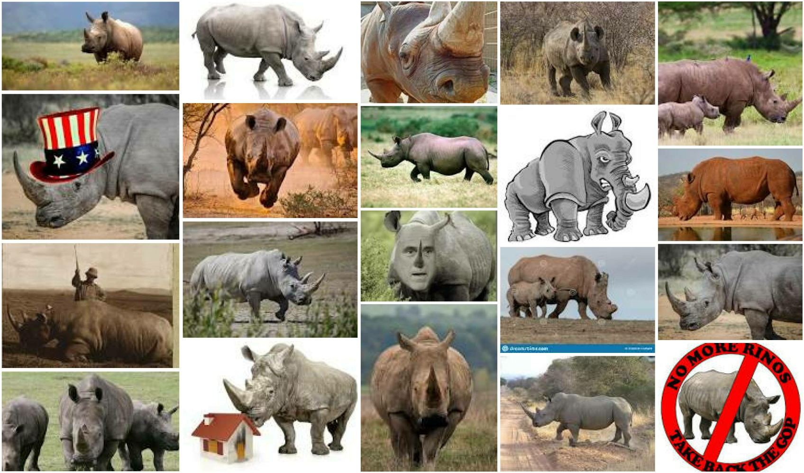

# quicknews

Some R-based tools for working with digital media, including functions
for:

1.  extracting metadata for articles posted on Google News;
2.  resolving shortened URLs;
3.  scraping online news article content per user-specified URL; and
4.  downloading & summarizing online images.

## Installation

``` r
library(devtools)
devtools::install_github("jaytimm/quicknews")
```

## Usage

### § Google News metadata

The `qnews_get_newsmeta` retrieves metadata from news articles posted to
Google News. There are two search parameters: `term` & `since`. By
default, metadata for articles included in the Headlines section are
extracted. Options for the `since` parameter include `1y`, `1d`, and
`7d`.

``` r
metas <- quicknews::qnews_get_newsmeta (term = NULL, since = NULL)
```

| date       | source               | title                                                                             |
|:-----------|:---------------------|:----------------------------------------------------------------------------------|
| 2021-05-09 | New York Post        | Remnants of Chinese rocket land in Indian Ocean                                   |
| 2021-05-09 | The Associated Press | In tense Jerusalem, flag-waving Israeli march to go ahead                         |
| 2021-05-09 | Los Angeles Times    | No-show high school students reject COVID reopening rules                         |
| 2021-05-09 | ABC News             | Florida reports more than 10,000 COVID-19 variant cases, surge after spring break |
| 2021-05-09 | Fox News             | Afghanistan girls school bombing death toll soars to 50                           |

### § Article content

The `qnews_extract_article` functions scrapes web content from URLs
specified in the `links` parameter. Via `rvest` and `xml2`. The function
contains a simple filter for culling html nodes not relevant to article
content. It is not perfect – no article extractor is – but no Java
dependencies.

``` r
articles <- quicknews::qnews_extract_article(metas$link[1:5])

list(title = strwrap(articles$title[1], width = 60), 
     text = strwrap(articles$text[1], width = 60)[1:10])
```

    ## $title
    ## [1] "Remnants of Chinese rocket land in Indian Ocean"
    ## 
    ## $text
    ##  [1] "A large out-of-control Chinese rocket has come down in the" 
    ##  [2] "Indian Ocean. Remnants of the rocket landed west of the"    
    ##  [3] "Maldives archipelago, Chinese state media said, ending days"
    ##  [4] "of speculation of where the Long March 5B rocket might"     
    ##  [5] "land. The odds of the spacecraft landing on a populated"    
    ##  [6] "area of the earth were low, and the likelihood of injuries" 
    ##  [7] "were even lower, according to engineers. The potential"     
    ##  [8] "debris zone could have been as far north as New York, and"  
    ##  [9] "as far south as Chile, scientists said. Last year, the"     
    ## [10] "first Long March 5B damaged some buildings when it crashed"

``` r
articles2 <- parallel::mclapply(metas$link,
                                quicknews::qnews_extract_article,
                                mc.cores = 6)
```

### § Download images

``` r
tweets_df1 <- rtweet::search_tweets("#foxitis", 
                                    n = 1000, 
                                    include_rts = F) 

tweet_pics <- tweets_df1 %>% filter(!is.na(media_url)) 
```

``` r
quicknews::img_download_images(link = unlist(tweet_pics$media_url)[1:49], 
                               dir = tempdir(), 
                               prefix = 'foxitis', 
                               scale_border = T)
```

### § Build collage

The `img_build_collage` function builds a collage per a user specified
directory of images – based on the `magick` package and this
[post](https://masalmon.eu/2017/03/19/facesofr/).

``` r
quicknews::img_build_collage(dir = tempdir(), 
                             dimx = 7, 
                             dimy = 7, 
                             prefix = 'foxitis')
```


### § Google image links

``` r
search <- 'rino'
links <- quicknews::img_get_gurls(x = search)
```

``` r
quicknews::img_download_images(link = links, 
                               dir = tempdir(), 
                               prefix = search, 
                               scale_border = T)

quicknews::img_build_collage(dir = tempdir(), 
                             dimx = 5, 
                             dimy = 4, 
                             prefix = search)
```



### § Resolve shortened urls

``` r
clean_urls <- quicknews::twt_clean_urls(url = tweets_df1$urls_url)
shorts <- clean_urls %>% filter(is_short == 1)
quicknews::twt_unshorten_urls(x = shorts$urls_url)
```
